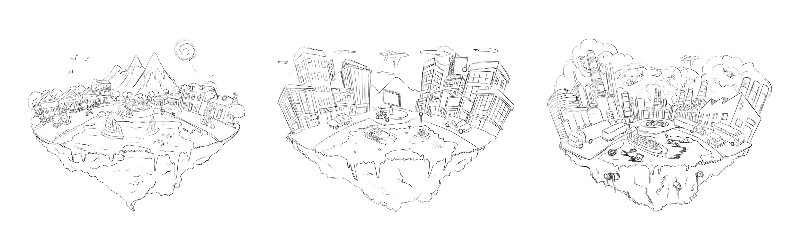
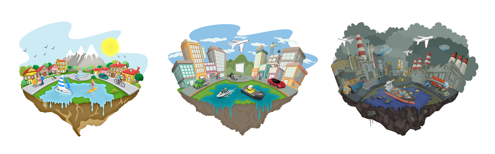

# Let's raise awerness about air polution!

Breathe Garden is a project of Dynamic NFTs that change based on the air polution in your city. It uses Chainlink's `Any API` oracle to connect to AQICN.org and fetch the levels of PM2.5, PM10, O3, and NO2 in your city and change the Metadata of your NFT accordingly.

For this, I've designed 3 illustrations that represents 3 levels of pollution: low, medium and high.
Here is my first draft:

And here is my final version:

Regarding the smart contract, I took my inspiration from the [Chainlink Weather NFT tutorial](https://github.com/kwsantiago/weather-nft), but mine is much more advanced as it can handle multiple cities. Indeed users can choose a city when minting their Breathe NFT. However I admit it has been quite a challenge to manage the automated update of multiple Dynamic NFTs from different cities.

Go to [http://breathe.garden](http://breathe.garden) and connect your wallet. Make sure you are on the Mumbai Testnet.

Enter the name of your city, for instance `berlin` then click `Mint New Breathe NFT`.

Metamask opens a transaction to mint the NFT on the smart contract. This will also trigger a chainlink request to AQICN.org to get the pollution level of the city you minted and set the corresponding Metadata of your Breathe NFT.

Now go to OpenSea. The NFT should show a temporary loading image while waiting for the Chainlink request to be fullfilled. Wait a little.

The Breathe NFT should then update to the Low/Medium/High Pollution Metadata depending on the AQICN pollution index in the selected city.

Note that I also implemented Chainlink's automation service to update the polution levels of all tokens at regular intervals.

In the next few days you should see your Breathe NFT been updated to other Pollution levels as the AQICN pollution index is updating.

Note that it is completly free to mint a Breathe NFT so go ahead, mint and share yours! I hope that Breathe Garden will evantually raise awerness of air polution and help reverse climate change.
